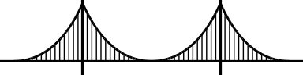
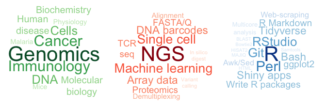

<!-- README.md is generated from README.Rmd. Please edit that file -->

<!-- badges: start -->

<!-- badges: end -->



## The biologist who learnt to code

I build bridges between wet-lab scientists and bioinformaticians. I’ve
spent \>5 years on either side of the divide and I therefore speak both
lab-talk and code-lingo. Below is an overview of what I do: I understand
this
<span style="color:#238B45;font-weight:bold;font-size:larger">biology</span>,
I can study it with these
<span style="color:#CB181D;font-weight:bold;font-size:larger">technologies</span>,
and I can make sense of the data using these
<span style="color:#2171B5;font-weight:bold;font-size:larger">computer
programs</span>. <!-- Expand a little, perhaps tailored to Novo -->



### Experience

`Mar 2021 - Present` **Director, Head of Data Science & Automation**
(Clinical Microbiomics)

`Aug 2019 - Mar 2021` **Bioinformatics specialist** (Clinical
Microbiomics)

`Jun 2019` **Freelance bioinformatics expert** (Immumap Services)

  - I developed a software tool needed for analysis of NGS data from the
    dCODE platform used for detection of more than 1000 different
    antigen-specific T cells.

`Oct 2016 - May 2019` **Postdoc** (Hadrup Lab, DTU Health Technology)

  - The group works on immunotherapy of cancer and autoimmune diseases
    and consists of 30 experimentalists and 2 bioinformaticians. I
    completed the following projects:
    1.  Establish an analysis pipeline for single cell sequencing of T
        cells in parallel with antigen-specificity screening using DNA
        barcodes
    2.  Predict neoepitopes arising at novel exon-exon junctions upon
        aberrant mRNA splicing in disease (such as myelodysplastic
        syndrome)
    3.  Predicting cross-reactivity of T cells to avoid adverse effects
        of immunotherapy *(published)*
    4.  Prediction of antigenic peptides in mouse tumor models
        *(published)*
  - My tasks also included data analysis and visualisation for other
    projects, as well as setting up automated analysis where possible to
    minimize errors and workload

`Jun 2015` **External research stay** (Ton Schumacher Lab, Antoni van
Leeuwenhoek Hospital, Amsterdam)

  - AI-based prediction of antigenic peptides for cancer immunotherapy

<!-- #### Education -->

<!-- * `2012 - 2016`  PhD in Cancer Genomics group, DTU Bioinformatics -->

<!--     + *Title: Therapeutic applications of the cancer genome* -->

<!--     + *I used machine learning to trace the organ source of cancer cells via DNA analyses [Marquard et al, BMC Medical Genomics 2015]* -->

<!--     + *I measured patterns of mutations in >5000 cancer patients, to reveal vulnerability to certain types of chemotherapy [Marquard et al, Biomarker Research 2015]* -->

<!--     + *I made a user-friendly program for analysing sequencing results of a novel screening method using DNA barcodes [Bentzen et al, Nature Biotehcnology 2016]* -->

<!--     + *courses include: perl and unix for bioinformaticians, tumor biology, systems biology* -->

<!-- * `2012` Machine Learning course by Andrew Ng at Stanford Uni (on Coursera.org)   -->

<!--     + *completed all exercises and tests* -->

<!--     + *implemented (from scratch) a neural network with backpropagation to image-recognition of hand-written digits* -->

<!-- * `2006 - 2012` BSc and MSc in Molecular Biomedicine, Uni. of Copenhagen -->

<!--     + *2 yrs lab-work for Master thesis in malaria lab* -->

<!--     + *Hands-on experience with: cell cultures, FACS, ELISA, qPCR, Biacore * -->

<!--     + *FELASA-C animal certificate* -->

<!--     + *courses include: molecular and cell biology, genetics, pathology, biochemistry, statistics, cell signaling, immunology* -->

<!-- * `2006` Study abroad at University of New South Wales, Australia -->

### Awards

`2017` Recipient of DTU’s Young Researcher Award

### Education

`2012 - 2016` **PhD in Cancer Genomics** (DTU Bioinformatics)

  - Title: Therapeutic applications of the cancer genome. Incl. 3
    published papers:
    1.  I used machine learning to trace the organ source of cancer
        cells via DNA analyses
    2.  I measured patterns of mutations in \>5000 cancer patients, to
        reveal vulnerability to certain types of chemotherapy
    3.  I made a user-friendly program for analysing sequencing results
        of a novel screening method using DNA barcodes
  - Courses include:
      - perl and unix | biological sequence analysis
      - tumor biology | computational network biology

`2012` **Machine Learning course** (by Stanford Uni at Coursera.org)

  - implemented (from scratch) a neural network with backpropagation for
    image-recognition of hand-written digits

`2006 - 2012` **BSc and MSc in Molecular Biomedicine** (Uni. of
Copenhagen)

  - 2 yrs in malaria lab for MSc thesis, including hands-on: cell
    cultures, FACS, ELISA, qPCR, Biacore
  - FELASA-C laboratory animal science certificate
  - Courses include:
      - molecular and cell biology | cell signaling | pathology
      - protein- and biochemistry | immunology | physiology
      - genetics | statistics | bioinformatics

`2006` **Study abroad** (University of New South Wales, Australia)

  - I studied biology, mathematics and databases, and was active in
    student societies.

### Workstyle

  - I am structured in my work and have an attention for detail
  - I would never assemble IKEA furniture without reading the manual
    thoroughly, and I therefore get it right the first time
  - I am creative and innovative. This resume was made with R Markdown,
    and includes a hyperbolic cosine graph to look like a bridge

### Volunteering & student jobs

`2007 - 2011` **Board member and chairman** (Biocenter Student House) |
*Learning to organise events, people and paperwork.*

`2010 - 2011` **Student assistant** (The Finsen Laboratory, Copenhagen
University Hospital) | *Responsible for genotyping of mice for breeding
and experiments.*

`2008 – 2010` **Student assistant** (Pediatric Oncology Research
Laboratory, Copenhagen University Hospital) | *Preparation of patient
blood samples for diagnosis and research, eg. buffy coat and DNA
extraction.*

`2007 – 2008` **Assistant press officer** (Dept. of Biology, University
of Copenhagen) | *Design of department website and English
translations.*

### Publications

`2019`

  - Pedersen NW, Holm A, Kristensen NP, Bjerregaard AM, Bentzen AK,
    **Marquard AM**, Tamhane T, Burgdorf KS, Ullum H, Jennum P. CD8+ T
    cells from patients with narcolepsy and healthy controls recognize
    hypocretin neuron-specific antigens. Nature Communications 10 (1)
    837 <span style="color:#238B45;font-weight:bold">Immunology</span> |
    <span style="color:#CB181D;font-weight:bold">DNA barcodes</span> |

  - Bjerregaard A-M, Pedersen TK, **Marquard AM**, Hadrup SR. Prediction
    of neoepitopes from murine sequencing data. Cancer Immunol
    Immunother.  
    <span style="color:#238B45;font-weight:bold">Genomics</span> |
    <span style="color:#238B45;font-weight:bold">Immunology</span> |
    <span style="color:#CB181D;font-weight:bold">NGS</span> |
    <span style="color:#CB181D;font-weight:bold">Gene expression</span>
    | <span style="color:#CB181D;font-weight:bold">Variant
    calling</span> |
    <span style="color:#2171B5;font-weight:bold">Bash</span> |
    <span style="color:#2171B5;font-weight:bold">Perl</span> |
    <span style="color:#2171B5;font-weight:bold">Multicore
    analysis</span> |
    <span style="color:#2171B5;font-weight:bold">Samtools</span>

`2018`

  - Bentzen AK, Such L, Jensen KK, **Marquard AM**, Jessen LE, Miller
    NJ, Church CD, Lyngaa R, Koelle DM, Becker JC, Linnemann C,
    Schumacher TNM, Marcatili P, Nghiem P, Nielsen M, Hadrup SR. T cell
    receptor fingerprinting enables in-depth characterization of the
    interactions governing recognition of peptide–MHC complexes. Nature
    Biotechnology *online*.  
    <span style="color:#238B45;font-weight:bold">Immunology</span> |
    <span style="color:#238B45;font-weight:bold">Biochemistry</span> |
    <span style="color:#CB181D;font-weight:bold">DNA barcodes</span> |
    <span style="color:#CB181D;font-weight:bold">FASTQ parsing</span> |
    <span style="color:#2171B5;font-weight:bold">RStudio</span> |
    <span style="color:#2171B5;font-weight:bold">write R packages</span>
    | <span style="color:#2171B5;font-weight:bold">Bash</span> |
    <span style="color:#2171B5;font-weight:bold">Git</span>

`2017`

  - Maternity leave (12 months)

  - Herschend J, Damholt ZBV, **Marquard AM**, Svensson B, Sørensen SJ,
    Hägglund P, Burmølle M. A meta-proteomics approach to study the
    interspecies interactions affecting microbial biofilm development in
    a model community. Scientific Reports 7, 16483.  
    <span style="color:#238B45;font-weight:bold">DNA</span> |
    <span style="color:#CB181D;font-weight:bold">FASTA parsing</span> |
    <span style="color:#CB181D;font-weight:bold">In silico digest</span>
    | <span style="color:#CB181D;font-weight:bold">Proteomics</span> |
    <span style="color:#2171B5;font-weight:bold">R</span>

  - Martinez P, Kimberley C, Birkbak NJ, **Marquard AM**, Szallasi Z,
    Graham T. Quantification of within-sample genetic heterogeneity from
    SNP-array data. Scientific Reports 7, 3248.  
    <span style="color:#238B45;font-weight:bold">Genomics</span> |
    <span style="color:#2171B5;font-weight:bold">R</span>

`2016`

  - Bentzen AK, **Marquard AM**, Lyngaa R, Saini SK, Ramskov S, Donia M,
    Such L, Furness AJS, McGranahan N, Rosenthal R, Straten PT, Szallasi
    Z, Svane IM, Swanton C, Quezada SA, Jakobsen SN, Eklund AC, Hadrup
    SR. Large-scale detection of antigen-specific T cells using
    peptide-MHC-I multimers labeled with DNA barcodes. Nature
    Biotechnology 34, 1037-1045.  
    <span style="color:#238B45;font-weight:bold">DNA</span> |
    <span style="color:#238B45;font-weight:bold">Immunology</span> |
    <span style="color:#238B45;font-weight:bold">Cancer</span> |
    <span style="color:#CB181D;font-weight:bold">DNA barcoding</span> |
    <span style="color:#CB181D;font-weight:bold">FASTQ parsing</span> |
    <span style="color:#CB181D;font-weight:bold">Alignment</span> |
    <span style="color:#2171B5;font-weight:bold">Perl</span> |
    <span style="color:#2171B5;font-weight:bold">R</span> |
    <span style="color:#2171B5;font-weight:bold">Git</span> |
    <span style="color:#2171B5;font-weight:bold">Multicore
    analysis</span> |
    <span style="color:#2171B5;font-weight:bold">Samtools</span> |
    <span style="color:#2171B5;font-weight:bold">Bowtie2</span>

`2015`

  - Maternity leave (9 months)

  - **Marquard AM**, Birkbak NJ, Thomas CE, Favero F, Krzystanek M,
    Lefebvre C, Ferté C, Jamal-Hanjani M, Wilson GA, Shafi S, Swanton C,
    André F, Szallasi Z, Eklund AC. TumorTracer: a method to identify
    the tissue of origin from the somatic mutations of a tumor specimen.
    BMC Medical Genomics 1–13.  
    <span style="color:#238B45;font-weight:bold">Cancer</span> |
    <span style="color:#238B45;font-weight:bold">Molecular
    biology</span> |
    <span style="color:#238B45;font-weight:bold">Genomics</span> |
    <span style="color:#CB181D;font-weight:bold">Machine learning</span>
    | <span style="color:#2171B5;font-weight:bold">Perl</span> |
    <span style="color:#2171B5;font-weight:bold">R</span> |
    <span style="color:#2171B5;font-weight:bold">write R packages</span>
    | <span style="color:#2171B5;font-weight:bold">Git</span> |
    <span style="color:#2171B5;font-weight:bold">Multicore
    analysis</span>

  - **Marquard AM**, Eklund AC, Joshi T, Krzystanek M, Favero F, Wang
    ZC, Richardson AL, Silver DP, Szallasi Z, Birkbak NJ. Pan-cancer
    analysis of genomic scar signatures associated with homologous
    recombination deficiency suggests novel indications for existing
    cancer drugs. Biomark Res 3, 9.  
    <span style="color:#238B45;font-weight:bold">Cancer</span> |
    <span style="color:#238B45;font-weight:bold">DNA</span> |
    <span style="color:#238B45;font-weight:bold">Molecular
    biology</span> |
    <span style="color:#238B45;font-weight:bold">Genomics</span> |
    <span style="color:#CB181D;font-weight:bold">Array data</span> |
    <span style="color:#2171B5;font-weight:bold">R</span> |
    <span style="color:#2171B5;font-weight:bold">Bash</span> |
    <span style="color:#2171B5;font-weight:bold">Multicore
    analysis</span>

`2014`

  - Favero F, Joshi T, **Marquard AM**, Birkbak NJ, Krzystanek M, Li Q,
    Szallasi Z, Eklund AC. Sequenza: allele-specific copy number and
    mutation profiles from tumor sequencing data. Annals of Oncology 26
    (1), 64-70.  
    <span style="color:#238B45;font-weight:bold">Cancer</span> |
    <span style="color:#238B45;font-weight:bold">DNA</span> |
    <span style="color:#238B45;font-weight:bold">Genomics</span> |
    <span style="color:#CB181D;font-weight:bold">NGS</span> |
    <span style="color:#2171B5;font-weight:bold">R</span> |
    <span style="color:#2171B5;font-weight:bold">write R packages</span>
    | <span style="color:#2171B5;font-weight:bold">Git</span>

`2013`

  - Berger SS, Turner L, Wang CW, Petersen JEV, Kraft M, Lusingu JPA,
    Mmbando B, **Marquard AM**, Bengtsson DBAC, Hviid L, Nielsen MA,
    Theander TG, Lavstsen T. Plasmodium falciparum expressing domain
    cassette 5 type PfEMP1 (DC5-PfEMP1) bind PECAM1. PLoS ONE 8,
    e69117.  
    <span style="color:#238B45;font-weight:bold">Cells</span> |
    <span style="color:#238B45;font-weight:bold">Molecular
    biology</span> |
    <span style="color:#238B45;font-weight:bold">Disease</span> |
    <span style="color:#238B45;font-weight:bold">Immunology</span>

`2012`

  - Lavstsen T, Turner L, Saguti F, Magistrado P, Rask TS, Jespersen JS,
    Wang CW, Berger SS, Baraka V, **Marquard AM**, Seguin-Orlando A,
    Willerslev E, Gilbert MTP, Lusingu J, Theander TG. Plasmodium
    falciparum erythrocyte membrane protein 1 domain cassettes 8 and 13
    are associated with severe malaria in children. Proc. Natl. Acad.
    Sci. U.S.A. 109, E1791–800.  
    <span style="color:#238B45;font-weight:bold">Cells</span> |
    <span style="color:#238B45;font-weight:bold">Molecular
    biology</span> |
    <span style="color:#238B45;font-weight:bold">Disease</span> |
    <span style="color:#238B45;font-weight:bold">Immunology</span> |
    <span style="color:#2171B5;font-weight:bold">R</span>

  - Wang CW, Lavstsen T, Bengtsson DC, Magistrado PA, Berger SS,
    **Marquard AM**, Alifrangis M, Lusingu JP, Theander TG, Turner L.
    Evidence for in vitro and in vivo expression of the conserved VAR3
    (type 3) plasmodium falciparum erythrocyte membrane protein 1.
    Malar. J. 11, 129.  
    <span style="color:#238B45;font-weight:bold">Cells</span> |
    <span style="color:#238B45;font-weight:bold">Molecular
    biology</span> |
    <span style="color:#238B45;font-weight:bold">Disease</span> |
    <span style="color:#238B45;font-weight:bold">Immunology</span>

<P style="page-break-before: always">

-----

### How I built the bridge:

``` r
#' Plot a bridge using cosine function and ggplot lines and segments
#'
#' @param p the x-axis value at which to plot the pillars (at p and -p) in the graph coordinates
#'
#' @return a ggplot object
#' @export
#'
#' @examples
#' plot.bridge(2)
#' 
plot.bridge <- function(p) {
  
  # x values around two pillars at position p and minus p
  x <- seq(-2*p, 2*p, length.out = 10000)
  
  # Hyperbolic cosine to get the centre curve
  y <- cosh(x)
  
  # Extend by repeating parts of the centre curve at the ends
  y[x < -p] <- y[x >= 0 & x <  p]
  y[x >  p] <- y[x <= 0 & x > -p]
  
  df <- data.frame(x = x, y = y)
  
  ggplot(df, aes(x = x, y = y)) +
    geom_line(size = 1) +
    ylim(0.5, cosh(p)) +
    
    # add road
    geom_hline(yintercept = 1, size = 1) +
    
    # add pillars
    geom_vline(xintercept = c(-p, p), size = 1.3) +
    
    # add ropes
    geom_segment(aes(x = x, y = 1, xend = x, yend = y),
                 data = df[round(seq(1, 10000, length.out = 61)),]) +
    
    # remove all axes etc.
    theme_void()
}
```
