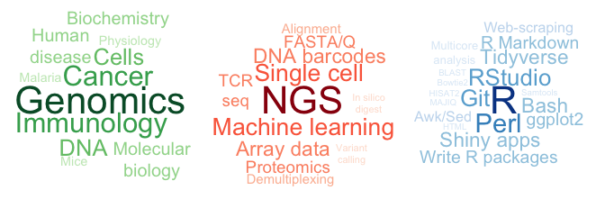

<!-- README.md is generated from README.Rmd. Please edit that file -->

<!-- badges: start -->

<!-- badges: end -->


## The biologist who learnt to code

I build bridges between wet-lab scientists and bioinformaticians. I’ve
spent \>5 years on either side of the divide and I therefore speak both
lab-talk and code-lingo. Below is an overview of what I do: I understand
this
<span style="color:#238B45;font-weight:bold;font-size:larger">biology</span>,
I can study it with these
<span style="color:#CB181D;font-weight:bold;font-size:larger">technologies</span>,
and I can make sense of the data using these
<span style="color:#2171B5;font-weight:bold;font-size:larger">computer
programs</span>. <!-- Expand a little, perhaps tailored to Novo -->



### Experience

`Jun 2021 - Apr 2022` **Maternity leave** (10 months)

`Mar 2021 - Present` **Director, Head of Data Science & Automation**
(Clinical Microbiomics)

`Aug 2019 - Mar 2021` **Bioinformatics specialist** (Clinical
Microbiomics)

  - 
`Jun 2019` **Freelance bioinformatics expert** (Immumap Services)

  - I developed a software tool needed for analysis of NGS data from the
    dCODE platform used for detection of more than 1000 different
    antigen-specific T cells.

`Aug 2017 - Aug 2018` **Maternity leave** (12 months)

`Oct 2016 - May 2019` **Postdoc** (Hadrup Lab, DTU Health Technology)

  - The group works on immunotherapy of cancer and autoimmune diseases
    and consists of 30 experimentalists and 2 bioinformaticians. I
    completed the following projects:
    1.  Establish an analysis pipeline for single cell sequencing of T
        cells in parallel with antigen-specificity screening using DNA
        barcodes
    2.  Predict neoepitopes arising at novel exon-exon junctions upon
        aberrant mRNA splicing in disease (such as myelodysplastic
        syndrome)
    3.  Predicting cross-reactivity of T cells to avoid adverse effects
        of immunotherapy *(published)*
    4.  Prediction of antigenic peptides in mouse tumor models
        *(published)*
  - My tasks also included data analysis and visualisation for other
    projects, as well as setting up automated analysis where possible to
    minimize errors and workload

`Jul 2015 - Apr 2016` **Maternity leave** (9 months)

`Jun 2015` **External research stay** (Ton Schumacher Lab, Antoni van
Leeuwenhoek Hospital, Amsterdam)

  - AI-based prediction of antigenic peptides for cancer immunotherapy

<!-- #### Education -->

<!-- * `2012 - 2016`  PhD in Cancer Genomics group, DTU Bioinformatics -->

<!--     + *Title: Therapeutic applications of the cancer genome* -->

<!--     + *I used machine learning to trace the organ source of cancer cells via DNA analyses [Marquard et al, BMC Medical Genomics 2015]* -->

<!--     + *I measured patterns of mutations in >5000 cancer patients, to reveal vulnerability to certain types of chemotherapy [Marquard et al, Biomarker Research 2015]* -->

<!--     + *I made a user-friendly program for analysing sequencing results of a novel screening method using DNA barcodes [Bentzen et al, Nature Biotehcnology 2016]* -->

<!--     + *courses include: perl and unix for bioinformaticians, tumor biology, systems biology* -->

<!-- * `2012` Machine Learning course by Andrew Ng at Stanford Uni (on Coursera.org)   -->

<!--     + *completed all exercises and tests* -->

<!--     + *implemented (from scratch) a neural network with backpropagation to image-recognition of hand-written digits* -->

<!-- * `2006 - 2012` BSc and MSc in Molecular Biomedicine, Uni. of Copenhagen -->

<!--     + *2 yrs lab-work for Master thesis in malaria lab* -->

<!--     + *Hands-on experience with: cell cultures, FACS, ELISA, qPCR, Biacore * -->

<!--     + *FELASA-C animal certificate* -->

<!--     + *courses include: molecular and cell biology, genetics, pathology, biochemistry, statistics, cell signaling, immunology* -->

<!-- * `2006` Study abroad at University of New South Wales, Australia -->

### Awards

`2017` Recipient of DTU’s Young Researcher Award

### Education

`2012 - 2016` **PhD in Cancer Genomics** (DTU Bioinformatics)

  - Title: Therapeutic applications of the cancer genome. Incl. 3
    published papers:
    1.  I used machine learning to trace the organ source of cancer
        cells via DNA analyses
    2.  I measured patterns of mutations in \>5000 cancer patients, to
        reveal vulnerability to certain types of chemotherapy
    3.  I made a user-friendly program for analysing sequencing results
        of a novel screening method using DNA barcodes
  - Courses include:
      - perl and unix | biological sequence analysis
      - tumor biology | computational network biology

`2012` **Machine Learning course** (by Stanford Uni at Coursera.org)

  - implemented (from scratch) a neural network with backpropagation for
    image-recognition of hand-written digits

`2006 - 2012` **BSc and MSc in Molecular Biomedicine** (Uni. of
Copenhagen)

  - 2 yrs in malaria lab for MSc thesis, including hands-on: cell
    cultures, FACS, ELISA, qPCR, Biacore
  - FELASA-C laboratory animal science certificate
  - Courses include:
      - molecular and cell biology | cell signaling | pathology
      - protein- and biochemistry | immunology | physiology
      - genetics | statistics | bioinformatics

`2006` **Study abroad** (University of New South Wales, Australia)

  - I studied biology, mathematics and databases, and was active in
    student societies.

### Workstyle

  - I am structured in my work and have an attention for detail
  - I would never assemble IKEA furniture without reading the manual
    thoroughly, and I therefore get it right the first time
  - I am creative and innovative. This resume was made with R Markdown,
    and includes a hyperbolic cosine graph to look like a bridge

### Volunteering & student jobs

`2007 - 2011` **Board member and chairman** (Biocenter Student House) |
*Learning to organise events, people and paperwork.*

`2010 - 2011` **Student assistant** (The Finsen Laboratory, Copenhagen
University Hospital) | *Responsible for genotyping of mice for breeding
and experiments.*

`2008 – 2010` **Student assistant** (Pediatric Oncology Research
Laboratory, Copenhagen University Hospital) | *Preparation of patient
blood samples for diagnosis and research, eg. buffy coat and DNA
extraction.*

`2007 – 2008` **Assistant press officer** (Dept. of Biology, University
of Copenhagen) | *Design of department website and English
translations.*

### Publications

| title                                                                                                                                                   | author                                                                  | journal                                         | number                | cites | year |
| :------------------------------------------------------------------------------------------------------------------------------------------------------ | :---------------------------------------------------------------------- | :---------------------------------------------- | :-------------------- | ----: | ---: |
| Evidence for in vitro and in vivo expression of the conserved VAR3 (type 3) Plasmodium falciparum erythrocyte membrane protein 1                        | CW Wang, T Lavstsen, DC Bengtsson, PA Magistrado, SS Berger, …          | Malaria journal                                 | 11 (1), 1-11          |    28 | 2012 |
| Plasmodium falciparum erythrocyte membrane protein 1 domain cassettes 8 and 13 are associated with severe malaria in children                           | T Lavstsen, L Turner, F Saguti, P Magistrado, TS Rask, JS Jespersen, …  | Proceedings of the National Academy of Sciences | 109 (26), E1791-E1800 |   257 | 2012 |
| Plasmodium falciparum expressing domain cassette 5 type PfEMP1 (DC5-PfEMP1) bind PECAM1                                                                 | SS Berger, L Turner, CW Wang, JEV Petersen, M Kraft, JPA Lusingu, …     | PloS one                                        | 8 (7), e69117         |    57 | 2013 |
| TumorTracer: a method to identify the tissue of origin from the somatic mutations of a tumor specimen                                                   | **AM Marquard**, NJ Birkbak, CE Thomas, F Favero, M Krzystanek, …       | BMC medical genomics                            | 8 (1), 1-13           |    42 | 2015 |
| Pan-cancer analysis of genomic scar signatures associated with homologous recombination deficiency suggests novel indications for existing cancer drugs | **AM Marquard**, AC Eklund, T Joshi, M Krzystanek, F Favero, ZC Wang, … | Biomarker research                              | 3 (1), 1-10           |   120 | 2015 |
| Sequenza: allele-specific copy number and mutation profiles from tumor sequencing data                                                                  | F Favero, T Joshi, **AM Marquard**, NJ Birkbak, M Krzystanek, Q Li, …   | Annals of Oncology                              | 26 (1), 64-70         |   368 | 2015 |
| Method for identification of tissue or organ localization of a tumour                                                                                   | **AM Marquard**, AC Eklund, NJ Birkbak, ZI Szallasi                     |                                                 |                       |     6 | 2016 |
| Method for identification of tissue or organ localization of a tumour                                                                                   | **AM Marquard**, AC Eklund, NJ Birkbak, ZI Szallasi                     |                                                 |                       |     6 | 2016 |
| Large-scale detection of antigen-specific T cells using peptide-MHC-I multimers labeled with DNA barcodes                                               | AK Bentzen, **AM Marquard**, R Lyngaa, SK Saini, S Ramskov, M Donia, …  | Nature biotechnology                            | 34 (10), 1037-1045    |   196 | 2016 |
| Quantification of within-sample genetic heterogeneity from SNP-array data                                                                               | P Martinez, C Kimberley, NJ BirkBak, A Marquard, Z Szallasi, TA Graham  | Scientific reports                              | 7 (1), 1-12           |     4 | 2017 |
| A meta-proteomics approach to study the interspecies interactions affecting microbial biofilm development in a model community                          | J Herschend, ZBV Damholt, **AM Marquard**, B Svensson, SJ Sørensen, …   | Scientific reports                              | 7 (1), 1-13           |    28 | 2017 |
| T cell receptor fingerprinting enables in-depth characterization of the interactions governing recognition of peptide–MHC complexes                     | AK Bentzen, L Such, KK Jensen, **AM Marquard**, LE Jessen, NJ Miller, … | Nature biotechnology                            | 36 (12), 1191-1196    |    60 | 2018 |
| Prediction of neoepitopes from murine sequencing data                                                                                                   | AM Bjerregaard, TK Pedersen, **AM Marquard**, SR Hadrup                 | Cancer Immunology, Immunotherapy                | 68 (1), 159-161       |     3 | 2019 |
| CD8+ T cells from patients with narcolepsy and healthy controls recognize hypocretin neuron-specific antigens                                           | NW Pedersen, A Holm, NP Kristensen, AM Bjerregaard, AK Bentzen, …       | Nature communications                           | 10 (1), 1-12          |    47 | 2019 |
| Human endogenous retroviruses form a reservoir of T cell targets in hematological cancers                                                               | SK Saini, AD Ørskov, AM Bjerregaard, A Unnikrishnan, …                  | Nature communications                           | 11 (1), 1-14          |     8 | 2020 |
| Tumor-infiltrating T cells from clear cell renal cell carcinoma patients recognize neoepitopes derived from point and frameshift mutations              | UK Hansen, S Ramskov, AM Bjerregaard, A Borch, R Andersen, A Draghi, …  | Frontiers in immunology                         | 11, 373               |     8 | 2020 |

### How I built the bridge:

``` r
#' Plot a bridge using cosine function and ggplot lines and segments
#'
#' @param p the x-axis value at which to plot the pillars (at p and -p) in the graph coordinates
#'
#' @return a ggplot object
#' @export
#'
#' @examples
#' plot_bridge(2)
#' 
plot_bridge <- function(p) {
  
  # x values around two pillars at position p and minus p
  x <- seq(-2*p, 2*p, length.out = 10000)
  
  # Hyperbolic cosine to get the centre curve
  y <- cosh(x)
  
  # Extend by repeating parts of the centre curve at the ends
  y[x < -p] <- y[x >= 0 & x <  p]
  y[x >  p] <- y[x <= 0 & x > -p]
  
  df <- data.frame(x = x, y = y)
  
  ggplot(df, aes(x = x, y = y)) +
    geom_line(size = 1) +
    ylim(0.5, cosh(p)) +
    
    # add road
    geom_hline(yintercept = 1, size = 1) +
    
    # add pillars
    geom_vline(xintercept = c(-p, p), size = 1.3) +
    
    # add ropes
    geom_segment(aes(x = x, y = 1, xend = x, yend = y),
                 data = df[round(seq(1, 10000, length.out = 61)),]) +
    
    # remove all axes etc.
    theme_void()
}
```
